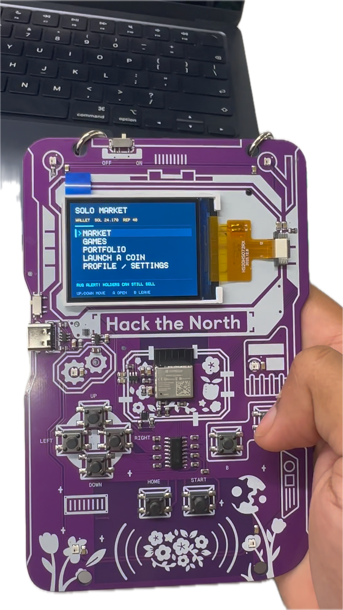
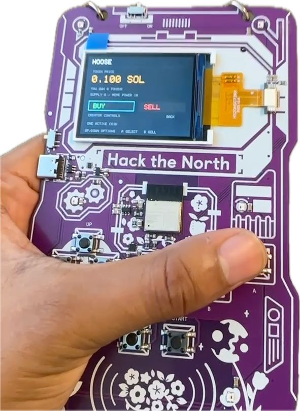
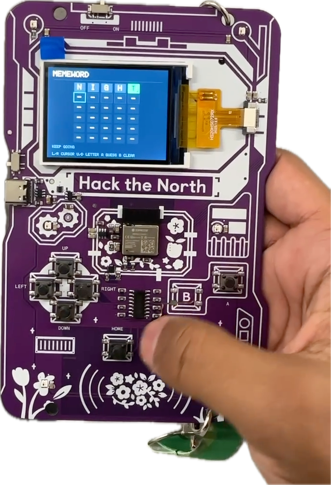

# Badge Market

A trading game built for the Hack the North 2026 badge. Play minigames to earn
fake SOL, launch a coin, and buy or sell coins with people nearby. Everything
runs on the badge, including the market host. No phone or internet connection
is needed, and all currency stays inside the game.

<table>
  <tr>
    <th>Main screen</th>
    <th>Buy / sell</th>
    <th>MEMEWORD</th>
  </tr>
  <tr>
    <td></td>
    <td></td>
    <td></td>
  </tr>
</table>

## How it works

Play solo, or have one badge choose **Host nearby market** and the others choose
**Join nearby market**. The badges communicate directly over ESP-NOW. The host
keeps track of everyone's wallets, coins, and trades, so it needs to stay on and
nearby while others play.

New players start with **25 fake SOL**. Launching a coin costs **2 SOL**, and each
player can have one active coin. Prices rise as tokens are bought and fall as
they are sold. Trades include a fee; the portfolio shows your holdings and their
sell value.

Creators can collect trading fees or **pull the rug** on their own coin. Rugging
costs reputation and stops new buys, but existing holders can still sell.

## Games

There are three games, with rewards paid into your market wallet:

- **MEMEWORD** — a Wordle-style puzzle: guess a five-letter word in six tries.
  Each puzzle pays once; repeat attempts are practice.
- **RUG RUN** — switch lanes, jump over rugs, dodge candles, and collect SOL in
  a 40-second arcade run.
- **RUG BOMB** — hot potato for 2–6 badges. Pass the rug by challenging another
  player to press the right button. Don't be holding it when the timer runs out.

RUG RUN and RUG BOMB aren't pictured above. See the [player guide](MARKET-README.md)
for game controls, reward limits, and a walkthrough of a shared market.

## Controls and saves

Use **Up/Down** to move through menus, **A** to select, and **B** to go back.
On a coin's detail screen, **A** opens Buy and **B** opens Sell. Choose a quantity,
then confirm the trade with A.

**Start** opens options in games or returns to the dashboard elsewhere.
**Home** opens the leave prompt. Choose **Save and close** as host or
**Save and leave** in solo before switching off. The host saves the shared
market; guests can rejoin it later with the same badge. Solo and hosted markets
have separate wallets and saves.

## Build and install

The current version is standalone **C++17 firmware for the ESP32-C3**, built with
**ESP-IDF 5.5.3**. From the repository root:

```sh
# Install the local toolchain once.
bash tools/setup_esp_idf.sh

# Run the native tests and build the firmware.
bash tools/test_native.sh
bash tools/firmware.sh build

# Replace the port with your badge's serial port.
bash tools/firmware.sh flash /dev/cu.usbmodem1101
```

Flashing replaces the stock badge firmware and its apps. The flash script backs
up the full badge first and stops if that backup fails. The native firmware is
not an upload for the online Lua IDE. Use the [firmware guide](firmware/README.md)
for connection steps, restoring a backup, and troubleshooting.

All players need compatible native firmware; use **v0.3.1** on both badges.
The older Lua app cannot join a native market. USB power is recommended for
demos while battery-only operation is still being validated.

## Repository

| Path | Contents |
| --- | --- |
| [`firmware/core/`](firmware/core/) | Market rules, multiplayer state, and game logic |
| [`firmware/main/`](firmware/main/) | Badge UI, hardware drivers, ESP-NOW, and save storage |
| [`firmware/tests/`](firmware/tests/) | Native host tests |
| [`tools/`](tools/) | Toolchain setup, build, backup, flash, and packaging scripts |
| [`app/badge_market/`](app/badge_market/) | Earlier Lua app for the stock firmware |
| [`simulator/`](simulator/) | Browser simulator for the Lua app |

The [native verification record](firmware/VERIFICATION.md) covers testing and
remaining hardware checks. The retained Lua app has its own
[installation and development notes](docs/lua-app.md).
