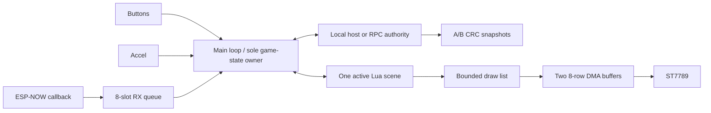

> SUPERSEDED TARGET: The newly supplied `badge-app-guide.md` documents stock Lua APIs. See `docs/stock-runtime.md` for the implementation target; the custom-firmware design below is retained as an alternative, not implemented claims.

# BADGE MARKET — implementation contract

## Existing system assessment (2026-09-19)

The supplied workspace contains only `custom-firmware-hal.md`; no firmware,
Lua interpreter, renderer, package transport, storage implementation, build,
or partition CSV is present. No existing driver can be reused yet. The host
has Clang, make and Python; ESP-IDF is not installed. USB device
`/dev/cu.usbmodem1101` is present. Opening its console does not provide a
heap baseline. No firmware has been flashed or erased.

**Measured hardware baseline: unavailable.** Free/minimum heap, largest block,
stock Lua usage, display allocations, original partition layout, flash delta
and frame latency must remain unknown until firmware source or a running
instrumented build is available. Desktop sizes are not ESP32 heap measurements.

Build a standalone firmware adapter, a portable C engine, bounded Lua scenes,
and a desktop badge simulator sharing that exact engine and Lua code. Preserve
the supplied guide. Do not invent compatibility with the unavailable stock
package-transfer API.

## Budget proposals, subject to on-device profiling

| Owner | Initial ceiling | Lifetime |
|---|---:|---|
| Host market | 32 players, 64 coins, 8 holdings/player | Host session |
| Client cache | 8 coin records + local player | Session |
| Lua allocator | 64 KiB hard cap | Interpreter |
| LCD | 2 × 320 × 8 × 2 = 10,240 bytes | Boot |
| Renderer | 128 bounded drawing commands + 30 stripe hashes | Boot |
| Incoming packets | 8 × max 250 bytes + source metadata | Boot |
| Nearby peers | 16 entries | Session |
| Persistence | One bounded serialization scratch area, host only | Host |
| Heap safety reserve | 32 KiB free internal RAM target | Always |

The caps bound consumption; they do not assert the sum fits alongside IDF.
The firmware must log checkpoints before/after radio, Lua, display and host
allocation. Refuse optional allocations when the reserve would be breached.

## C / Lua boundary

| Native C | Lua |
|---|---|
| Integer economy, balances, holdings, reward admission | Menus and screen flow |
| Canonical request sequencing and validation | Coin editor and confirmations |
| Packet codecs, CRC, retries, discovery | Reaction and maze presentation |
| Snapshot validation and A/B storage | Visual effects and humorous copy |
| Bounded draw commands, font rasterization, LCD DMA | Declarative draw calls |
| Button debounce, accelerometer, radio lifecycle | Scene lifecycle |
| Capped Lua allocator and instruction hook | Active scene only |

## Task and timing ownership

One main game task owns Lua, engine and cache. ESP-IDF Wi-Fi callbacks only
copy into a fixed FreeRTOS queue. Main handles a bounded number per turn.
LCD ISR releases DMA ownership only. Input is scanned every 10 ms; application
updates use elapsed monotonic time with a capped delta. No gameplay in callbacks.
Flash snapshots run on a storage worker, from an immutable staged snapshot.
DMA waits and I2C transactions have finite timeouts. NFC and BLE are not started.
ESP-NOW requires Wi-Fi STA started; no AP association or internet is needed.

## State and authority

Host is explicitly chosen on a badge; clients explicitly join a discovered
host. Never silently fork the economy on host disappearance. Host loss makes
transactions unavailable while local games/screens continue. Capacity failures
are explicit; canonical players/holdings are never evicted. 64 coin slots permit
50+ launches without an unbounded world. Client rows are paged and cached.

Player: 32-bit ID, integer GAME_SOL, reputation, rugs, launch cooldown,
reward budget, last accepted request and result, 8 compact holdings.
Coin: bounded name/symbol, creator ID, supply, reserve, community treasury,
creator treasury, meme power, first-holder bitset, creation epoch, flags.
Holding: coin ID, quantity, qualifying quantity, hold-start epoch.

## Exact starting economy

1 SOL = 1000 GAME_SOL. New players receive 25,000. Launch costs 2,000
(burned); one live coin per creator. Maximum supply 10,000 tokens/coin.
Base token cost = 100, slope = 5. Buy `n` at supply `q` costs
`n*100 + 5*n*(2*q+n-1)/2`, computed in checked 64-bit arithmetic.
Sell `n` returns the same curve interval beginning at `q-n`.
Fee = ceil(curve_cost * 200 / 10,000), a 2% fee. Half the fee (floor)
goes to creator treasury; the remainder to community treasury. Curve reserve
is a separate liability and cannot be withdrawn or rugged.

Epochs last 120 seconds. Only quantity present at the previous epoch boundary
qualifies for the next distribution. Buying does not retroactively qualify;
selling reduces qualifying quantity and resets streak. At the boundary, half
the community treasury is distributed proportionally to eligible quantities
weighted by 100/110/120/125% capped hold streak. Integer dust remains in treasury.
No claim endpoint can mint money. Meme power decays 5% per epoch; each first
unique holder adds 10, bounded at 1000. Holder bits prevent rebuy farming.

Reaction reward: 250 per correct answer, up to 8 answers, max 6,000/player/epoch,
20-second cooldown, host-issued one-use game ticket with expiry. Host validates
seeded input transcript and minimum response time. This limits casual farming;
modified firmware can fabricate plausible timing (not cryptographic anti-cheat).
Creator withdrawals: 10/25/50% of creator treasury. Full rug drains both fee
treasuries, disables buys and holder rewards, drops reputation by 35, adds one
rug, and delays launches by 3 epochs. Existing holders can still redeem against
the protected curve reserve. No other player's wallet is debited by a rug.

## Wire contract

Little-endian explicit encoding, never transmit raw C structs. Header includes
magic, version, type, sender, destination, market ID, request sequence, payload
length, and CRC32. Entire packet <=250 bytes. CRC detects corruption, not forgery.
Bind player IDs to the observed source MAC in the firmware transport. This is
a friendly hackathon network, not an authenticated financial system.

One in-flight client RPC; retry identical bytes at bounded intervals, then
display timeout/retry. Every mutating request consumes the next canonical
per-player sequence, including rejected requests. The last result is cached;
older sequences are rejected. Rejoin gets the host's next sequence, so client
reboot does not reset transaction identity. Cache the last request fingerprint
to reject a different operation reusing the same sequence.

Discovery beacons are small and jittered. At most 16 recently seen peers;
expire stale peers and use oldest-entry eviction. Packet handlers reject wrong
host/market, wrong destination, lengths, versions and checksum before mutation.

## Persistence

Explicit little-endian schema, magic/version, monotonic snapshot sequence,
body length and CRC. A/B slots in a dedicated partition; write inactive slot,
read back/validate, then recognize the highest valid sequence. On boot validate
both; corruption falls back to the older valid slot. Do not persist padding,
pointers or transient game tickets. Persist request sequence/result with balances.
Periodic checkpoints may lose changes since the last completed save on abrupt
power loss; UI diagnostics expose save status. No claim of per-trade durability.

The proposed custom partition CSV must fit 4 MiB. It is not the stock partition
table and must never be used as evidence of current on-device offsets. Read and
back up actual flash before any manual replacement. This task does not flash.

## Scene/resource lifecycle

Load active Lua scene from an embedded flash source registry. Exit releases the
scene reference and module cache, stops scene effects and games, then GC runs
at the transition. Font/procedural icons stay in flash. No image atlas or world
framebuffer. Render when scene state changes; rasterize into 8-row stripes and
send only stripes whose hashes changed. This trades cheap CPU for 153,600 bytes
of saved framebuffer RAM. Input stays independent of network completion.

## Phases and acceptance

1. Assessment/budgets (this document); actual measurements remain hardware gate.
2. Portable economy, codecs, persistence and adversarial native tests.
3. Scene runtime, local market and Reaction Trader.
4. Host/client RPC, discovery, retries, social play and rug broadcast.
5. Badge HAL adapter and shared-engine desktop simulation.
6. Test accounting, replay, packet loss, power-loss snapshots, scene churn;
   report measured desktop sizes and remaining hardware verification honestly.
7. On hardware: build against IDF 5.5.3; capture boot/radio/Lua/scene heap,
   stack high-water marks, flash map, p50/max frame and input times; then tune.

Lua package receiving cannot be integrated until the original transport/API
is supplied. Do not expose arbitrary file loading, raw flash, OS, debug, sockets,
or stock `require` to games. Optional BLE/NFC/phone bridge is outside this slice.

References: [ESP-NOW 5.5.3](https://docs.espressif.com/projects/esp-idf/en/v5.5.3/esp32c3/api-reference/network/esp_now.html),
supplied [HAL guide](../custom-firmware-hal.md).
